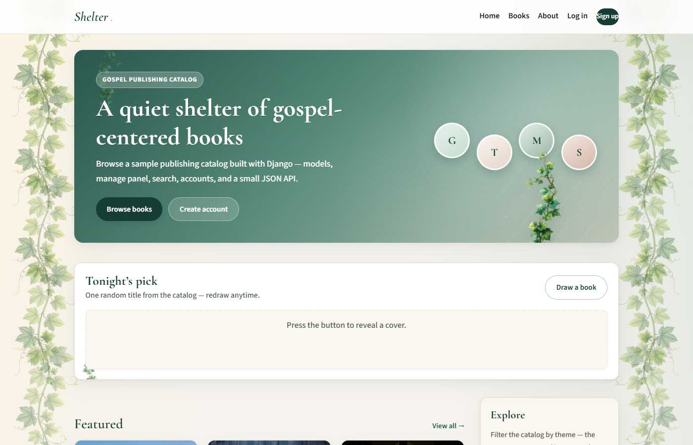
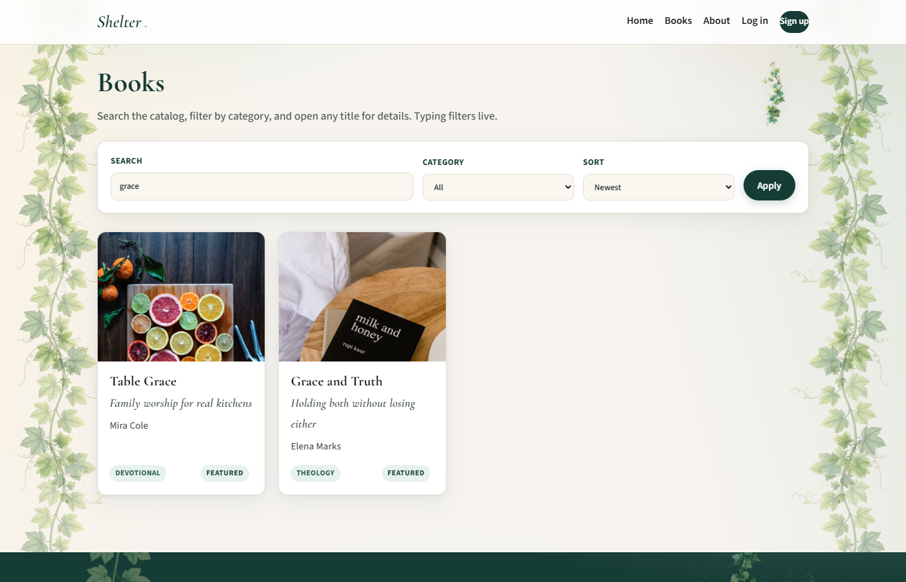
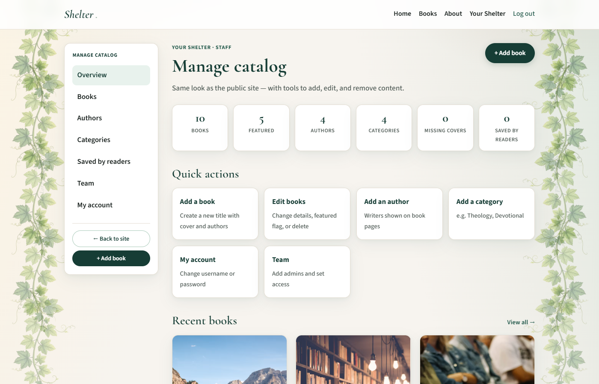

# Shelter

A small **gospel-publishing catalog** built with **Django** for portfolio use.

**Shelter** (as in *abrigo*) demonstrates the same web patterns used by content/publishing products: catalog models, staff admin, search and filters, authenticated reading lists, and a thin read-only JSON API — server-rendered with Django templates (no SPA).

> **Disclaimer:** Fictional titles and authors only. **Not affiliated with Crossway** or any publisher. Built as a learning / portfolio project for a Web Developer (Django) candidacy.

**Live:** [https://shelter-phi.vercel.app](https://shelter-phi.vercel.app)  
**Source:** [github.com/Godz57/shelter](https://github.com/Godz57/shelter)

## Features

- Book catalog with authors, categories, featured flags, and cover images
- Public home, book list, book detail, author detail, **About**
- Search (title / subtitle / description / author), category filter, sort
- Live search on `/books/` (API-backed)
- **Site-styled staff manage panel** at `/manage/` (CRUD + team permissions)
- `/admin/` redirects to `/manage/`
- Sign up / log in / log out
- **Your Shelter** personal reading list (add / remove)
- Read-only JSON API: `GET /api/books/`, `GET /api/books/<slug>/`, `GET /api/books/pick/`
- Health check: `GET /health/`
- Seed command with sample data and cover URLs
- Favicon, Open Graph tags, mobile nav, custom 404/500
- Postgres-ready settings, WhiteNoise static files, security headers in production
- Automated tests + GitHub Actions CI

## Stack

| Layer | Choice |
|-------|--------|
| Language | Python 3.12+ |
| Framework | Django 5.2 |
| API | Django REST Framework |
| DB (dev) | SQLite |
| DB (prod) | PostgreSQL via `DATABASE_URL` (Neon) |
| Static | WhiteNoise |
| Hosting | Vercel |

## Architecture (short)

```
config/          # settings, root URLs, WSGI
catalog/         # models, public views, /manage/, API, seed, tests
templates/       # base + catalog + registration + staff
static/          # css, js, brand images
```

**Domain:** `Author`, `Category`, `Book`, `ReadingListItem`, `StaffProfile`  
**Public site:** server-rendered templates  
**Staff:** site-styled CRUD at `/manage/` with per-section permissions  
**API:** read-only DRF viewset for books

## Screenshots

| Home | Search | Staff manage |
|------|--------|--------------|
|  |  |  |

- **Home** — hero, Tonight’s pick, featured grid  
- **Books** — live search (`?q=grace`)  
- **Manage** — site-styled staff dashboard (`/manage/`)

Recapture guide: [docs/screenshots/README.md](docs/screenshots/README.md)

## Portfolio / CV one-liner

> Django catalog app (Shelter) with models, staff manage panel, auth, search, reading list, and read-only JSON API — deployed on Vercel with Postgres.

Links: [Live](https://shelter-phi.vercel.app) · [GitHub](https://github.com/Godz57/shelter) · [About](https://shelter-phi.vercel.app/about/)

## Local setup

```powershell
cd shelf
python -m venv .venv
.\.venv\Scripts\Activate.ps1
pip install -r requirements.txt
copy .env.example .env
python manage.py migrate
python manage.py seed_catalog
python manage.py createsuperuser
python manage.py runserver
```

Open http://127.0.0.1:8000/

## Tests

```powershell
python manage.py test
```

CI runs the same suite on every push/PR to `main` (GitHub Actions).

## API examples

```bash
curl http://127.0.0.1:8000/api/books/
curl http://127.0.0.1:8000/api/books/grace-and-truth/
curl "http://127.0.0.1:8000/api/books/?q=grace"
curl http://127.0.0.1:8000/api/books/pick/
curl http://127.0.0.1:8000/health/
```

## Deploy (Vercel)

Django is detected via `manage.py`. Static files are collected automatically; `build.py` runs migrations + seed.

### 1. Postgres (required)

Vercel has no durable disk — use **Neon**, **Vercel Postgres**, or **Supabase**. Set `DATABASE_URL`.

### 2. Environment variables

| Variable | Value |
|----------|--------|
| `DJANGO_SECRET_KEY` | long random string |
| `DJANGO_DEBUG` | `0` |
| `DATABASE_URL` | `postgres://…` |
| `DJANGO_SUPERUSER_USERNAME` | optional |
| `DJANGO_SUPERUSER_PASSWORD` | set in production |

See `.env.example` for the full list.

### 3. After deploy

- Public site: `https://<project>.vercel.app/`
- Staff: Log in as staff user → `/manage/`
- About: `/about/`

## Why this project

Crossway-style products are content-heavy web apps: catalogs, admin tooling, accounts, and APIs. Shelter is a focused exercise in those Django fundamentals — honest portfolio evidence, not a claim of years of production Django tenure.

## License

MIT — use and adapt freely for your own portfolio.
